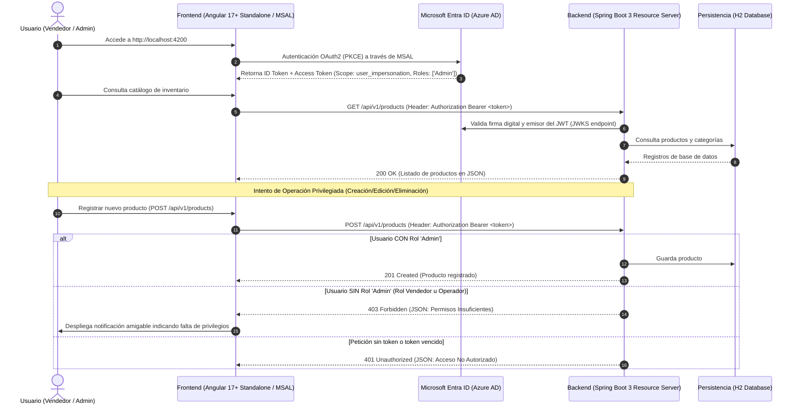

# Sistema de Gestión de Inventario para Locales Comerciales (Cloud Native)
### Arquitectura SPA + Resource Server protegida por Microsoft Entra ID (Azure AD) y AWS API Gateway
**Asignatura**: Desarrollo Cloud Native I (DSY1107) • **Evaluación Parcial N° 1**

Solución empresarial desacoplada y nativa de nube para el control y administración de inventario, terminales de punto de venta (POS) y suministros para locales comerciales.

> 📖 **Guía de Despliegue en la Nube de AWS**: Para instrucciones de despliegue en instancias EC2, AWS RDS PostgreSQL y AWS API Gateway, consulta [AWS_DEPLOYMENT_GUIDE.md](file:///c:/Users/gtoro/Desktop/Cloud%20Native%201/AWS_DEPLOYMENT_GUIDE.md).

---

## 1. Diagrama de Arquitectura de Seguridad y Flujo de Autenticación



---

## 2. Estructura de Proyectos

```
Cloud Native 1/
├── backend/                                   # Proyecto 1: Resource Server (Spring Boot 3)
│   ├── pom.xml                                # Dependencias Maven + Spring Cloud Azure BOM 5.23.0
│   ├── mvnw & mvnw.cmd                        # Maven Wrapper para Windows, Linux y Mac
│   └── src/
│       ├── main/
│       │   ├── java/com/retail/inventory/
│       │   │   ├── InventoryBackendApplication.java
│       │   │   ├── config/
│       │   │   │   ├── AzureJwtGrantedAuthoritiesConverter.java # Mapeo de claim 'roles' a ROLE_Admin
│       │   │   │   ├── CorsConfig.java                          # Habilita CORS para localhost:4200
│       │   │   │   └── SecurityConfig.java                      # @EnableMethodSecurity + oauth2ResourceServer
│       │   │   ├── controller/
│       │   │   │   ├── CategoryController.java                  # Endpoints REST /api/v1/categories
│       │   │   │   └── ProductController.java                   # Endpoints REST /api/v1/products
│       │   │   ├── domain/
│       │   │   │   ├── Category.java                            # Entidad JPA Category
│       │   │   │   └── Product.java                             # Entidad JPA Product
│       │   │   ├── dto/
│       │   │   │   ├── CategoryRequestDto.java & ResponseDto
│       │   │   │   ├── ProductRequestDto.java & ResponseDto
│       │   │   │   └── ErrorResponseDto.java                    # RFC-7807 JSON estándar
│       │   │   ├── exception/
│       │   │   │   ├── GlobalExceptionHandler.java              # @RestControllerAdvice (400, 401, 403, 404, 500)
│       │   │   │   ├── CustomAuthenticationEntryPoint.java      # Captura 401 en filtro Spring Security
│       │   │   │   └── CustomAccessDeniedHandler.java           # Captura 403 en filtro Spring Security
│       │   │   ├── repository/
│       │   │   │   ├── CategoryRepository.java
│       │   │   │   └── ProductRepository.java
│       │   │   └── service/
│       │   │       ├── CategoryService.java & CategoryServiceImpl.java
│       │   │       └── ProductService.java & ProductServiceImpl.java
│       │   └── resources/
│       │       ├── application.yml            # Parámetros exactos de Microsoft Entra ID
│       │       └── data.sql                   # Semilla de datos para locales comerciales
│       └── test/java/...                      # Tests unitarios y de integración de seguridad
│
└── frontend/                                  # Proyecto 2: SPA (Angular 17+ Standalone)
    ├── package.json                           # @azure/msal-browser y @azure/msal-angular
    ├── angular.json & tsconfig.json
    └── src/
        ├── environments/
        │   ├── environment.ts                 # Configuración de MSAL, scopes y protectedResourceMap
        │   └── environment.development.ts
        └── app/
            ├── app.config.ts                  # MSALInstance, Guard, Interceptor & HttpClient providers
            ├── app.routes.ts                  # Rutas protegidas con MsalGuard
            ├── app.component.ts|html|css      # Layout general con Shell
            ├── models/                        # Modelos TypeScript (Product, Category, UserProfile)
            ├── services/
            │   ├── auth.service.ts            # Wrapper reactivo para MSAL (login, logout, claims, roles)
            │   └── inventory.service.ts       # Consumo de API REST y manejo reactivo de 401/403
            └── components/
                ├── navbar/                    # Topbar con perfil, rol y botones login/logout
                ├── inventory/                 # KPIs de stock, búsqueda, tabla y tarjetas reactivas
                ├── product-modal/             # Formulario reactivo para crear/editar productos
                ├── categories/                # Gestión de rubros comerciales
                └── alert/                     # Banner inteligente para códigos 401 y 403
```

---

## 3. Configuración en Microsoft Entra ID (Azure AD)

Los identificadores ya se encuentran configurados en el código con los valores exactos requeridos:

| Parámetro | Valor Exacto en la Solución |
| :--- | :--- |
| **Tenant ID** | `73d72038-30bf-4ab9-85bc-a402de679470` |
| **Backend App Client ID** | `afcd0a4e-f3f3-4934-9861-4d8d13cecc30` |
| **Backend App ID URI** | `api://afcd0a4e-f3f3-4934-9861-4d8d13cecc30` |
| **Backend Delegated Scope** | `api://afcd0a4e-f3f3-4934-9861-4d8d13cecc30/user_impersonation` |
| **Frontend App Client ID** | `61d2f1d7-99e9-4cf7-83fc-51456a9eb5b6` |
| **Frontend Redirect URI** | `http://localhost:4200` |

### Pasos en el Portal de Azure (si se desea administrar usuarios/roles):
1. **App Registration del Backend (`afcd0a4e-f3f3-4934-9861-4d8d13cecc30`)**:
   - En **Expose an API**, asegúrate de tener configurado el scope `user_impersonation`.
   - En **App roles**, crea un rol con valor exacto `Admin` (Allowed member types: *Users/Groups*).
2. **App Registration del Frontend (`61d2f1d7-99e9-4cf7-83fc-51456a9eb5b6`)**:
   - En **Authentication**, agrega plataforma **Single-page application (SPA)** con Redirect URI: `http://localhost:4200`.
   - En **API permissions**, agrega el permiso delegado `user_impersonation` de la API del Backend.
3. **Asignación de Roles**:
   - En **Enterprise Applications** -> tu Backend -> **Users and groups**, asigna los usuarios que tendrán el rol `Admin`. Los usuarios sin este rol actuarán como vendedores u operadores de solo lectura.

---

## 4. Instrucciones de Compilación y Ejecución

### Proyecto 1: Backend (Spring Boot 3)

#### Prerrequisitos:
- Java JDK 17 o superior.
- Conexión a Internet para descargar las dependencias de Maven y validar los metadatos OpenID de Azure AD.

#### Pasos de Ejecución:
1. Abre una terminal y navega al directorio del backend:
   ```bash
   cd backend
   ```
2. Ejecuta la aplicación usando el Maven Wrapper o Maven local:
   - **En Windows (PowerShell / CMD):**
     ```powershell
     .\mvnw.cmd spring-boot:run
     # O alternativamente con maven instalado:
     mvn spring-boot:run
     ```
   - **En Linux / macOS:**
     ```bash
     chmod +x mvnw
     ./mvnw spring-boot:run
     ```
3. El servicio iniciará en: `http://localhost:8080`
   - Consola H2 para inspección de datos: `http://localhost:8080/h2-console`
     - JDBC URL: `jdbc:h2:mem:inventorydb`
     - User: `sa`
     - Password: *(en blanco)*

---

### Proyecto 2: Frontend (Angular 17+ Standalone)

#### Prerrequisitos:
- Node.js versión 18.19.0 o superior (se recomienda Node 20 LTS).
- Administrador de paquetes `npm`.

#### Pasos de Ejecución:
1. Abre una segunda terminal y navega al directorio del frontend:
   ```bash
   cd frontend
   ```
2. Instala las dependencias del proyecto:
   ```bash
   npm install
   ```
3. Inicia el servidor de desarrollo de Angular:
   ```bash
   npm start
   ```
4. Abre el navegador e ingresa a:
   ```
   http://localhost:4200
   ```
5. Presiona el botón **"Iniciar Sesión (Azure AD)"**. La aplicación redirigirá a Microsoft Entra ID para autenticar las credenciales del tenant. Al completar el inicio de sesión:
   - Podrás visualizar el catálogo de inventario precargado de locales comerciales.
   - Si tu cuenta cuenta con el rol `Admin`, podrás registrar, editar y borrar productos.
   - Si tu cuenta no posee dicho rol, cualquier intento de modificación mostrará inmediatamente una alerta amigable explicativa (código 403).

---

## 5. Pruebas de Validación de Endpoints y Seguridad

### Prueba 1: Petición sin Token (Rechazo con 401 Unauthorized)
```bash
curl -i -X GET http://localhost:8080/api/v1/products
```
**Respuesta Esperada (HTTP 401):**
```json
{
  "timestamp": "2026-09-03T23:00:00.000",
  "status": 401,
  "error": "Unauthorized",
  "message": "Acceso no autorizado: Token JWT ausente, expirado o con firma digital inválida. Inicie sesión en Microsoft Entra ID.",
  "path": "/api/v1/products"
}
```

### Prueba 2: Petición con Token sin Rol 'Admin' (Rechazo con 403 Forbidden)
```bash
curl -i -X POST http://localhost:8080/api/v1/products \
  -H "Authorization: Bearer <TOKEN_JWT_ROL_USUARIO>" \
  -H "Content-Type: application/json" \
  -d '{
    "sku": "POS-NEW-01",
    "name": "Lector Inalámbrico Bluetooth",
    "price": 89.99,
    "stock": 10,
    "categoryId": 1
  }'
```
**Respuesta Esperada (HTTP 403):**
```json
{
  "timestamp": "2026-09-03T23:00:00.000",
  "status": 403,
  "error": "Forbidden",
  "message": "Acceso Denegado: Su cuenta de Microsoft Entra ID carece del rol 'Admin' requerido para realizar operaciones de modificación.",
  "path": "/api/v1/products"
}
```

### Prueba 3: Petición con Token con Rol 'Admin' (Creación Exitosa 201 Created)
```bash
curl -i -X POST http://localhost:8080/api/v1/products \
  -H "Authorization: Bearer <TOKEN_JWT_ROL_ADMIN>" \
  -H "Content-Type: application/json" \
  -d '{
    "sku": "POS-NEW-01",
    "name": "Lector Inalámbrico Bluetooth",
    "price": 89.99,
    "stock": 10,
    "categoryId": 1
  }'
```
**Respuesta Esperada (HTTP 201):**
```json
{
  "id": 20,
  "sku": "POS-NEW-01",
  "name": "Lector Inalámbrico Bluetooth",
  "price": 89.99,
  "stock": 10,
  "categoryId": 1,
  "categoryName": "Puntos de Venta (POS)"
}
```

### Prueba 4: Consulta de Productos con Usuario Autenticado (200 OK)
```bash
curl -i -X GET http://localhost:8080/api/v1/products \
  -H "Authorization: Bearer <TOKEN_JWT>"
```
**Respuesta Esperada (HTTP 200):**
Array JSON con los 19 productos comerciales iniciales insertados desde `data.sql`.
